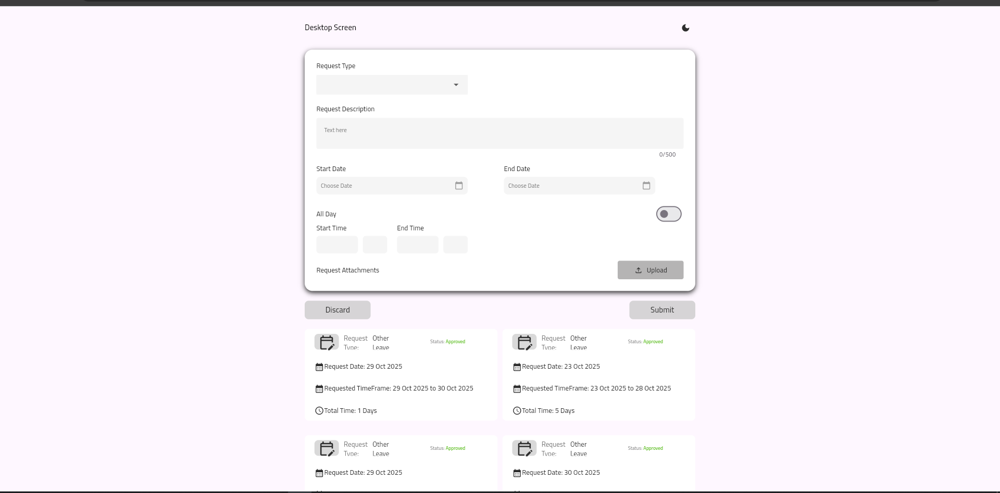
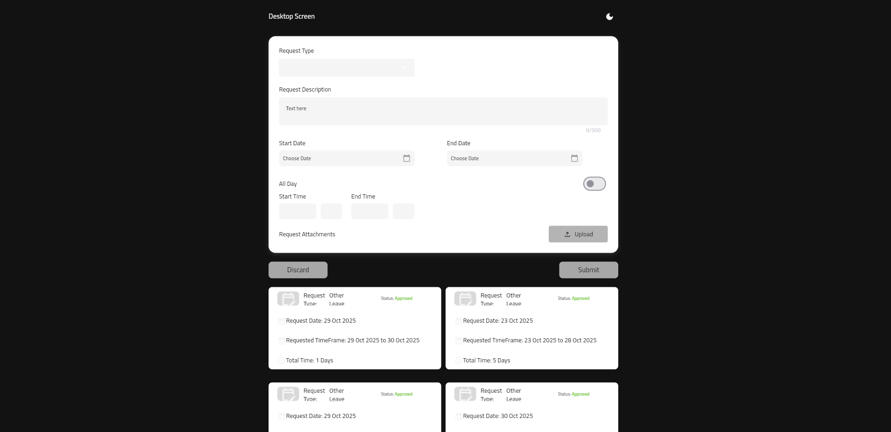
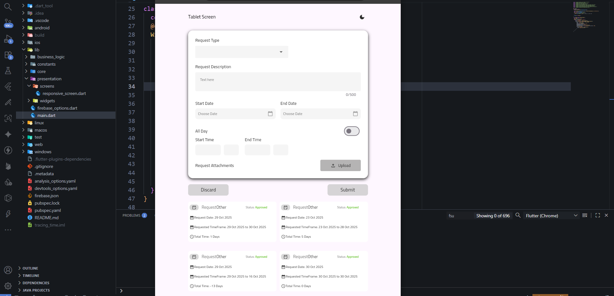
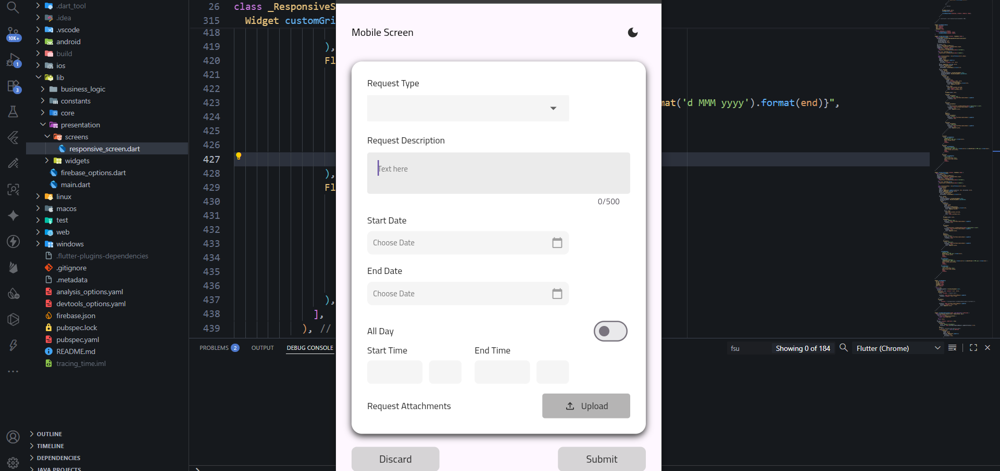
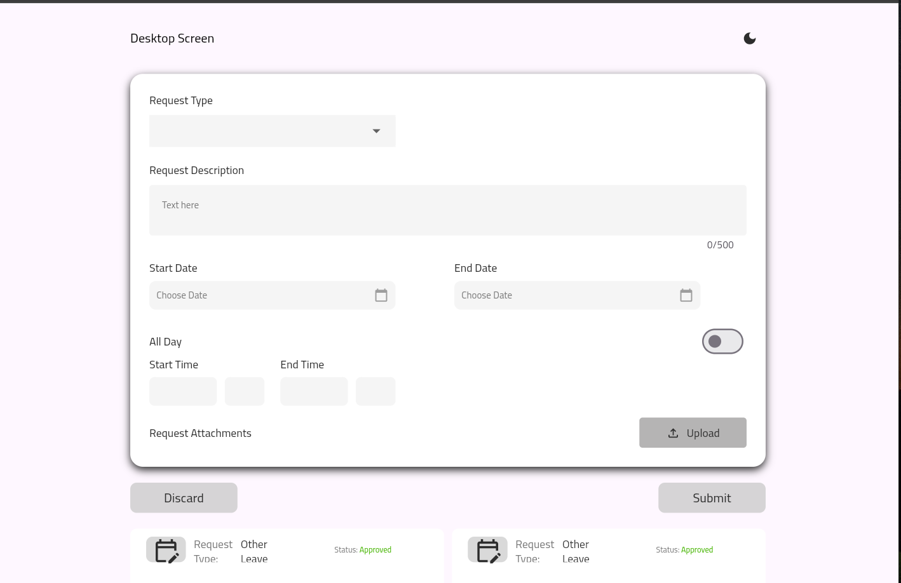
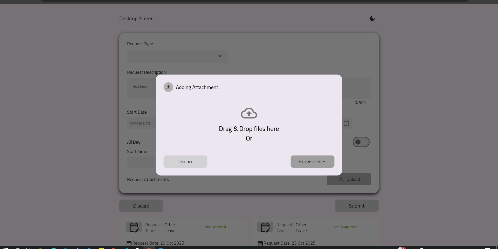

   

  
  
  
  
  
  

# 🕒 Tracing Time

  

**Tracing Time** هو تطبيق Flutter احترافي لإدارة وتتبع طلبات الإجازات (Leave Requests) داخل بيئة العمل.  
يتيح للمستخدمين إنشاء طلبات إجازة، رفع المرفقات، وتتبع حالة الموافقات — مع دعم **الوضع الليلي** و**التصميم المتجاوب** لجميع الشاشات (Mobile, Tablet, Desktop, Web).

---

## 🚀 Features

- 🌗 **Light & Dark Theme**
- 💼 **Request Management System**
  - إنشاء طلبات جديدة (Vacation, Sick, Remote Work)
  - رفع مرفقات بصور أو ملفات (Firebase Storage)
  - تتبع الحالة (Approved / Pending / Rejected)
- 🧠 **State Management using Cubit (BLoC)**
- 🔥 **Firebase Integration**
  - Firestore (لتخزين البيانات)
  - Firebase Storage (لتخزين الصور)
- 💾 **Local Storage using Hive**
- 📱 **Fully Responsive Design**
  - يدعم الهاتف، التابلت، والويب.
- ✅ **Form Validation**
  - لجميع الحقول (Dropdowns, TextFields, DatePickers)
- ☁️ **File Upload System**
  - عبر FilePicker أو ImagePicker
- 🌍 **Internationalization Ready** (جاهز لدعم لغات متعددة)

---

## 🧩 Project Architecture

تم تصميم المشروع باستخدام **Clean Architecture + Cubit Pattern**

This project is a starting point for a Flutter application.

A few resources to get you started if this is your first Flutter project:

- [Lab: Write your first Flutter app](https://docs.flutter.dev/get-started/codelab)
- [Cookbook: Useful Flutter samples](https://docs.flutter.dev/cookbook)

For help getting started with Flutter development, view the
[online documentation](https://docs.flutter.dev/), which offers tutorials,
samples, guidance on mobile development, and a full API reference.
